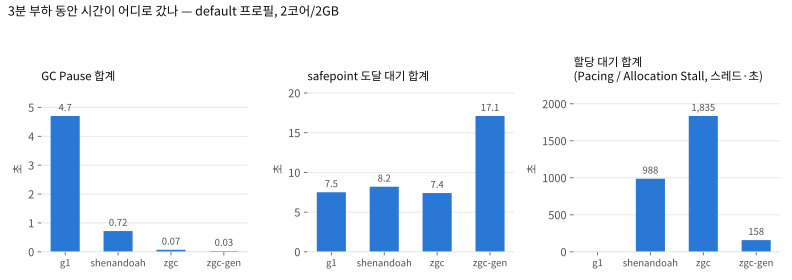
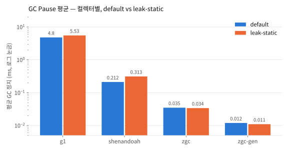
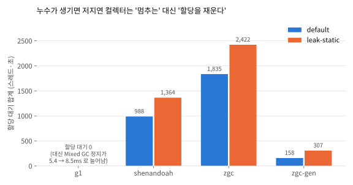

# gc-roots-board-lab

Spring 게시판 서버 하나를 놓고 **G1 · Shenandoah · ZGC · Generational ZGC** 가 같은 부하에서 어떻게 다르게 멈추는지, 그리고 **무엇이 GC 루트가 되는지** 를 GC 로그·힙 덤프·JFR 로 직접 확인하는 실험 레포.

> 실행 환경: Docker `--cpus=2 --memory=2g`, 힙 1GB 고정, Temurin 21.0.12, k6 VU 50 × 3분 · 2026-09-21

## 한 줄 결론

**저지연 컬렉터는 "멈추지 않는" 대신 "할당을 재운다".** GC Pause 만 보면 Shenandoah·ZGC 는 G1 의 1/20~1/400 이지만, 2코어 환경에서 3분 부하를 걸자 Shenandoah 는 할당 스레드를 988초 재웠고(Pacing), ZGC 는 Allocation Stall 로 1,835초를 세웠다. "정지 1ms" 와 "응답 지연 1ms" 는 다른 말이다.

<picture>
  <source media="(prefers-color-scheme: dark)" srcset="docs/img/time-budget-dark.svg">
  
</picture>

## 목차

- [핵심 결과](#핵심-결과)
- [가설과 판정](#가설과-판정)
- [빠른 시작](#빠른-시작)
- [실험 설계](#실험-설계)
- [레포 구조](#레포-구조)
- [진행 현황과 잔여 작업](#진행-현황과-잔여-작업)

## 핵심 결과

### 1. Pause 만 보면 이론 그대로다

<picture>
  <source media="(prefers-color-scheme: dark)" srcset="docs/img/pause-dark.svg">
  
</picture>

| 컬렉터 | GC 정지 횟수 | 최대 정지 | 평균 정지 | 총 정지 (3분) | 정지의 정체 |
|---|---|---|---|---|---|
| **G1** | 979 | 134 ms | 4.8 ms | 4.7 s | `Evacuate Collection Set` — 살아있는 객체 복사가 정지의 98% |
| **Shenandoah** | 3,380 | 56 ms | 0.21 ms | 0.7 s | Init/Final Mark, Init/Final Update Refs — 주기당 4개, 각 0.1~0.3 ms |
| **ZGC** | 2,016 | 2.0 ms | 0.035 ms | 0.07 s | Mark Start / Mark End / Relocate Start — 주기당 3개 |
| **ZGC-gen** | 2,068 | 0.35 ms | 0.012 ms | 0.03 s | 위와 같음, Minor 631 + Major 35 |

G1 한 주기가 로그에 그대로 보인다: `Pause Young (Concurrent Start)` → `Concurrent Mark Cycle` → `Pause Remark` → `Pause Cleanup` → `Pause Young (Prepare Mixed)` → `Pause Young (Mixed)`. 3분 동안 145번 돌았다.

### 2. 그런데 진짜 지연은 Pause 밖에 있다

| 컬렉터 | GC Pause 합계 | safepoint 도달 대기 | 할당 대기 (스레드·초) | 힙 압박 신호 |
|---|---|---|---|---|
| G1 | 4.7 s | 7.5 s | — | 없음 |
| Shenandoah | 0.7 s | 8.2 s | **Pacing 988 s** | Degenerated 0 |
| ZGC | 0.07 s | 7.4 s | **Allocation Stall 1,835 s** (24,649회, 최대 1.0 s) | 주기 672회 중 638회가 Stall 트리거 |
| ZGC-gen | 0.03 s | 17.1 s | Allocation Stall 158 s (최대 160 ms) | Stall 이 ZGC 의 1/11.6 |

- **safepoint 도달 대기**: Pause 자체는 수십 µs 여도, 2코어에서 톰캣 스레드 100개를 세우는 데 그 100배가 든다. Shenandoah `[gc,stats]` 의 Net(0.16 ms) vs Gross(최대 902 ms) 차이가 그것.
- **할당 대기**: 동시 GC 가 할당 속도를 못 따라가면 Shenandoah 는 Pacer 로 할당 스레드를 재우고, ZGC 는 Allocation Stall 로 세운다. 요청 스레드 입장에선 이게 곧 응답 지연이지만 `Pause` 로그에는 안 찍힌다.
- **세대 구분 ZGC** 는 매번 힙 전체를 표시하지 않아 Stall 을 1/11.6 로 줄였다. 책의 "JDK 21 세대 구분 ZGC 도입" 이 왜 필요했는지가 여기서 보인다.

### 3. 누수가 생기면 — 가설 5

<picture>
  <source media="(prefers-color-scheme: dark)" srcset="docs/img/leak-alloc-wait-dark.svg">
  
</picture>

`leak-static` 프로필은 상세 조회마다 `Post` 를 `static Map` 에 넣고 지우지 않는다. 구세대가 262 → 635 리전으로 자랐다.

| 컬렉터 | Pause 변화 | Pause 밖 변화 |
|---|---|---|
| G1 | Mixed 평균 **5.4 → 8.5 ms** (분 단위 7.5 → 9.0 ms 로 누적 증가) | — |
| Shenandoah | 0.21 → 0.31 ms (그대로) | **Degenerated GC 5회** (최대 131 ms), Pacing 988 → 1,364 s |
| ZGC | 0.035 → 0.034 ms (그대로) | Stall 1,835 → **2,422 s**, 평균 74 → 98 ms |
| ZGC-gen | 0.012 → 0.011 ms (그대로) | Stall 158 → **307 s** (×1.9), 최대 160 → 267 ms |

가설("G1 만 길어진다")은 Pause 기준으로 맞다. 하지만 세 저지연 컬렉터 모두 대가를 다른 곳에서 치렀다.

### 4. 실험하다 배운 것

- `jcmd GC.heap_dump` / `GC.class_histogram` 은 기본으로 **Full GC 를 강제**한다 (`Pause Full (Heap Inspection Initiated GC)` 165 ms). 비교 실행에 덤프를 섞으면 안 된다. `dump.sh` 는 `-all=true` 로 바꿨고 `summarize-gc.sh` 는 이런 정지를 따로 센다.
- k6 에 `sleep(0.05)` 를 두면 RPS 가 VU/0.05 ≈ 1,000 에 캡되어 컬렉터가 무엇이든 RPS 가 같아진다. 처리량 비교는 닫힌 루프(`SLEEP=0`)여야 한다.
- 세대 구분 ZGC 의 Minor 주기 로그는 소문자 `y:` 접두를 쓴다. 대문자 `Y:` 만 잡으면 정지 횟수를 1/12 로 잘못 센다.
- 호스트(M4 10코어)에서 돌리면 GC 스레드가 코어를 넉넉히 받아 차이가 흐려진다. `--cpus=2` 가 컬렉터 간 차이를 드러냈다.

전체 수치와 로그 관찰은 [docs/02-collector-compare.md](docs/02-collector-compare.md), 실행별 기록은 `results/<collector>/<profile>/summary.md`.

## 가설과 판정

| # | 가설 | 판정 | 근거 |
|---|---|---|---|
| 1 | 스프링 빈은 GC 루트가 아니다 | 미확인 | MAT 로 `PostService` 경로 추적 필요 |
| 2 | 요청 중 DTO·엔티티는 Java Local 에만 매달리고 에덴에서 죽는다 | 정황 있음 | 히스토그램 상위 20 에 `Post` 없음. 확정은 MAT |
| 3 | 누수 시 루트 경로가 Java Local → System Class / Thread 로 바뀐다 | 미확인 | leak-static 덤프 + MAT |
| 4 | G1 은 이주에서 가장 길게 멈추고 Shenandoah·ZGC 는 1 ms 안팎. RPS 는 G1 최고 | **정지: 맞음** / RPS: 미확인 | 위 표. RPS 는 g1 만 기록(4,062) |
| 5 | 누수로 구세대가 커지면 G1 Mixed 만 길어진다 | **Pause 기준 맞음**, 단 할당 대기가 는다 | 위 표 |

## 빠른 시작

```bash
# 요구: JDK 21 (Temurin / Corretto / brew openjdk@21 — Oracle 빌드엔 Shenandoah 없음), k6, Docker Desktop
#       분석: Eclipse MAT (힙 덤프), JDK Mission Control (JFR)
./gradlew :app:build                          # 빌드 + 테스트 (셸 java 가 17 이어도 toolchain 이 21 을 찾는다)

scripts/run-docker.sh g1                      # 터미널 1: 2코어/2GB 컨테이너에서 서버
k6 run --summary-export results/g1/default/k6.json load/board.js    # 터미널 2: 3분 부하
#  Ctrl+C 로 서버 종료 (JFR 확정)

scripts/summarize-gc.sh --all                 # gc.log → 정지 시간 요약표
scripts/dump.sh g1 default mid                # 부하 중 힙 덤프 (루트 지도용, 비교 실행에는 섞지 말 것)
```

`run-docker.sh <g1|shenandoah|zgc|zgc-gen> [default|leak-static|leak-threadlocal|leak-listener]`. 환경변수 `CPUS`(2) `MEM`(2g) `HEAP`(1g) `MAX_PAUSE`(200) `BOARD_SEED_COUNT`(10000). 호스트에서 직접 띄우려면 `scripts/run.sh` (같은 인자).

## 실험 설계

**대상 앱** — Spring Boot 3.5 / Java 21 / H2 인메모리. `Post(id, title, content 1~4KB, author, viewCount, createdAt)`. `GET /posts?page=&size=` · `GET /posts/{id}` · `POST /posts`. 기동 시 더미 1만 건.

**부하** — k6, VU 50, 3분, 닫힌 루프. 목록 70% / 상세 20% / 작성 10%. 목록이 CLOB 본문 20건을 매번 로드해 초당 수 GB 를 할당한다 — 저지연 컬렉터의 "할당 속도 한계" 를 시험하는 조건.

**JVM 공통 옵션** — `-Xms1g -Xmx1g -XX:+AlwaysPreTouch -Xlog:gc*,safepoint -XX:StartFlightRecording:path-to-gc-roots=true`

| 인자 | 옵션 |
|---|---|
| `g1` | `-XX:+UseG1GC -XX:MaxGCPauseMillis=200` |
| `shenandoah` | `-XX:+UseShenandoahGC` |
| `zgc` | `-XX:+UseZGC` (JDK 21: 비세대) |
| `zgc-gen` | `-XX:+UseZGC -XX:+ZGenerational` |

**누수 시나리오** — 스프링 프로필로 켠다. 정상 프로필엔 `PostAccessListener` 구현체가 없고, 각 프로필이 하나씩 켠다.

| 프로필 | 무엇을 붙잡나 | 예상 루트 경로 |
|---|---|---|
| `leak-static` | 상세 조회마다 `static Map<Long, Post>` 에 저장 (키 = 조회 순번, 제거 없음) | System Class → static → Map → Post |
| `leak-threadlocal` | 필터가 `ThreadLocal<List<RequestContext>>` 에 append, `remove()` 생략 | Thread → threadLocals → Entry → List → Post |
| `leak-listener` | 상세 조회마다 싱글턴 빈의 리스트에 리스너 등록, 해제 없음 | Thread/System Class → ApplicationContext → 빈 → List → Post |

**측정** — `summarize-gc.sh` 가 `Pause ...` 이벤트(횟수·최대·평균·총)와 별도로 `[safepoint]` 총량, Allocation Stall, Degenerated/Full GC, Evacuation Failure 를 센다. Shenandoah Pacing 은 로그 끝 `[gc,stats]` 에서 읽는다.

**주의** — Docker Desktop 컨테이너는 Linux aarch64 VM 위에서 돈다. `--cpus=2` 는 CFS 쿼터라 JVM 은 `availableProcessors=2` 로 읽고 `ParallelGCThreads=2, ConcGCThreads=1` 로 잡는다. 호스트 실행(`run.sh`) 결과와 섞어 비교하지 않는다.

## 레포 구조

```
├── app/                          Spring Boot 게시판
│   └── src/main/java/io/github/hyujikoh/gcroots/
│       ├── post/                 Post, Repository, Service, Controller, Seeder, PostAccessListener 훅
│       └── leak/                 StaticMapLeak · ThreadLocalLeakFilter · ListenerRegistryLeak · /leak/stats
├── load/board.js                 k6 부하 스크립트 (SLEEP, VUS, DURATION 환경변수)
├── scripts/
│   ├── run.sh                    호스트에서 서버 실행 (JDK 21 자동 탐색)
│   ├── run-docker.sh             --cpus/--memory 제한 컨테이너에서 실행
│   ├── dump.sh                   힙 덤프 + 히스토그램 + 스레드 덤프 (컨테이너면 docker exec)
│   ├── summarize-gc.sh           gc.log 정지 시간 요약 (G1/Shenandoah/ZGC 공통)
│   └── charts.py                 docs/img 그래프 재생성
├── results/<collector>/<profile>/
│   ├── summary.md                실행 기록 (커밋)
│   ├── machine.txt, java-version.txt, jvm-flags.txt, histogram-*.txt
│   └── gc.log, rec.jfr, dump-*.hprof   (gitignore)
├── docs/
│   ├── 00-handoff.md             처음 세운 배경·가설·계획
│   ├── 01-gc-roots.md            힙 덤프로 확인한 루트 지도 (미실행)
│   ├── 02-collector-compare.md   컬렉터 비교 전체 수치와 로그 관찰
│   ├── 03-leak-scenarios.md      누수 시나리오별 루트 경로 (미실행)
│   └── img/                      README 그래프
├── BACKLOG.md                    잔여 작업과 이력
└── Dockerfile
```

## 진행 현황과 잔여 작업

| 단계 | 상태 |
|---|---|
| 게시판 앱 + 누수 시나리오 3종 + 스크립트 | 완료 |
| default 프로필 컬렉터 4종 | 완료 |
| leak-static 프로필 컬렉터 4종 | 완료 |
| MAT 루트 지도 (가설 1·2·3) | **미실행** — `results/g1/default/dump-mid.hprof` 확보됨 |
| leak-threadlocal / leak-listener | 미실행 |
| Shenandoah / ZGC 의 k6 RPS·p99 | 미기록 |

잔여 작업의 우선순위와 지금까지의 변경 이력은 [BACKLOG.md](BACKLOG.md).

## 참고

- 이론은 『JVM 밑바닥까지 파헤치기』(JDK 11~17 시점) 기준. 이후 변경: Shenandoah 는 포워딩 포인터를 마크 워드에 저장하고 연결 행렬을 제거; ZGC 는 JDK 21 에서 세대 구분 도입, JDK 23 부터 기본값.
- Shenandoah 의 세대 구분 모드는 JDK 21 에 없어 제외.
- 개인 학습용 레포. 회사 코드·설정·자격 증명을 포함하지 않는다.
